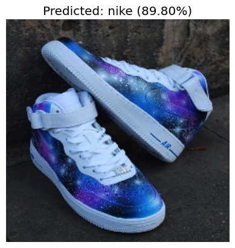
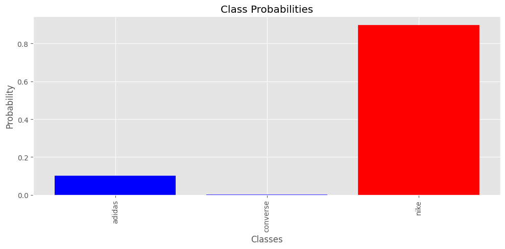

# Shoe Brand Classification (ResNet50)

Демонстрационный Jupyter Notebook для решения задачи многоклассовой классификации изображений обуви по трем брендам: **adidas, converse, nike**. 
Проект реализован с использованием метода Transfer Learning на базе глубокой сверточной нейросети.

**Стек технологий:** Python, PyTorch, torchvision, matplotlib.

## Пример работы модели

Инференс обученной модели на тестовом изображении с выводом распределения вероятностей по классам:

| Предсказание модели | Вероятности классов |
| :-: | :-: |
|  |  |

## Что реализовано "под капотом"

- **Архитектура:** Применяется предобученная модель **ResNet50** (веса ImageNet). Финальный полносвязный слой заменен для классификации на 3 целевых класса.
- **Пайплайн обучения:** 
  - Оптимизатор Adam (`lr=0.0005`), функция потерь `CrossEntropyLoss`, batch size 32 (10 эпох).
  - Загрузка данных через `ImageFolder` с приведением к размеру 224×224.
  - Сравнительные эксперименты: базовое обучение (только `Resize` и `ToTensor`) и обучение с **аугментациями** (`Resize(256)`, `RandomRotation(10)`, `CenterCrop(224)`, `RandomHorizontalFlip`, нормализация ImageNet).
- **Оценка качества:** Валидация после каждой эпохи, расчет метрик precision, recall, F1-score (~0.90 weighted avg), построение графиков loss/accuracy и матрицы ошибок (confusion matrix).
- **Чекпоинты:** Автоматическое сохранение весов лучшей (`best_model.pth`) и последней (`last_model.pth`) моделей.

## Результаты валидации

| Режим обучения | Точность (Accuracy) |
|---|---|
| Без аугментаций | ~90.4% |
| С аугментациями | ~88.6% |

## Данные

*Исходный датасет не включен в репозиторий из-за ограничений GitHub на размер файлов (объем тренировочной выборки составляет около 12 батчей). Все результаты, включая графики и предсказания, сохранены в выводе ячеек самого ноутбука (`.ipynb`).*

## Векторы развития проекта (Как можно улучшить)

Для повышения обобщающей способности модели на новых данных планируется:
- **Расширение датасета:** Текущий объем данных слишком мал для раскрытия потенциала тяжелых сетей.
- **Продвинутые аугментации:** Внедрение цветовых искажений (brightness/contrast/saturation), `RandomResizedCrop`, cutout/mixup.
- **Оптимизация архитектуры:** Использование более легких моделей (ResNet18, EfficientNet) для снижения риска переобучения на малом датасете, либо заморозка ранних блоков сети.
- **Тюнинг гиперпараметров:** Подбор learning rate, настройка ранней остановки (early stopping), добавление weight decay и label smoothing.
- **Продвинутая валидация:** Внедрение кросс-валидации вместо фиксированного сплита и балансировка классов.